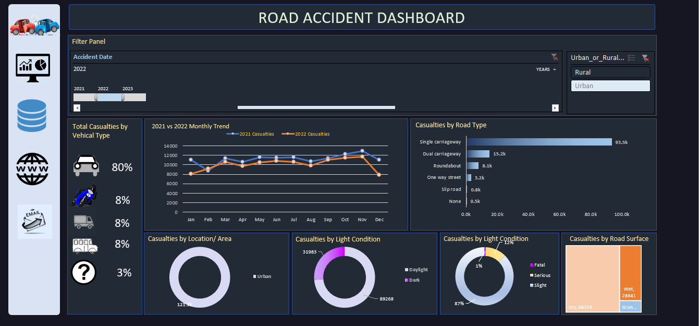
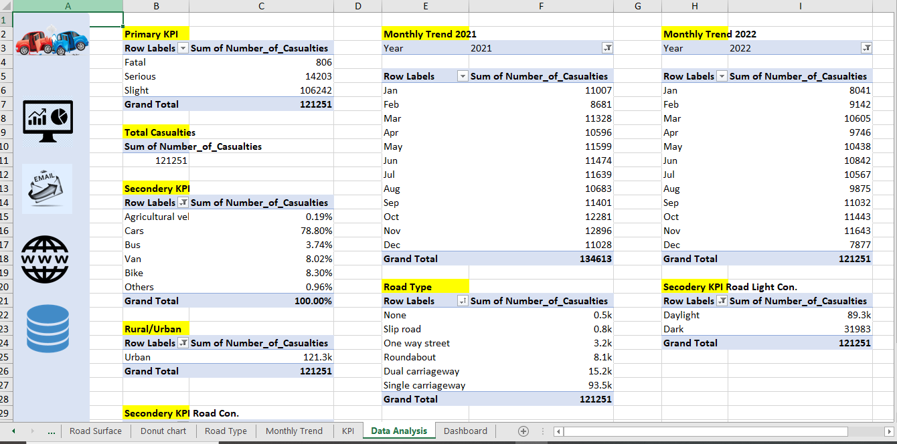

# Road-Accident-Excel-Project
This is an excel dashboard project
This project analyzes UK road accident data from 2021 to 2023 using Microsoft Excel to build an interactive and user-friendly dashboard.

## Tools & Technologies
Microsoft Excel

Pivot Tables

Data Cleaning & Transformation

Charts (Donut, Bar, Line, Treemap)

Interactive Dashboard with Slicers & Hyperlinked Navigation

## Dataset Overview
The dataset contains information on road casualties across the UK, with the following key columns:

Junction_Detail

Accident_Severity

Latitude, Longitude

Light_Conditions

Local_Authority_(District)

Carriageway_Hazards

Number_of_Casualties

Number_of_Vehicles

Police_Force

Road_Surface_Conditions

Road_Type

Speed_limit

Time

Urban_or_Rural_Area

Weather_Conditions

Vehicle_Type

## Data Cleaning & Preparation
Handled null/missing values

Data formatting for consistency

Created new time-based fields: Weekday, Month, Year

Added a timeline and slicers for interactivity

## KPI Metrics & Dashboard Elements
Primary KPIs:
Total Number of Casualties

Casualties by Accident Severity

Secondary KPIs:
Casualties by:

Light Condition

Road Surface Condition

Vehicle Type

Urban vs Rural Area

Road Type

## Dashboard Features
Interactive dashboard using Pivot Tables and Slicers

Visualized data using:

Donut Charts

Line Charts

Tree Maps

Bar Charts

Vertical Navigation Bar with Hyperlinks to:

Dashboard

Data Analysis Sheet

## Note to acccess excel file
File will not open as it is larger than 25MB. so click on 'raw file' or click on google drive link below to download excel file
**[click here to download excel file](Road Accident Data Analysis.xlsx)**
# file preview

, 

